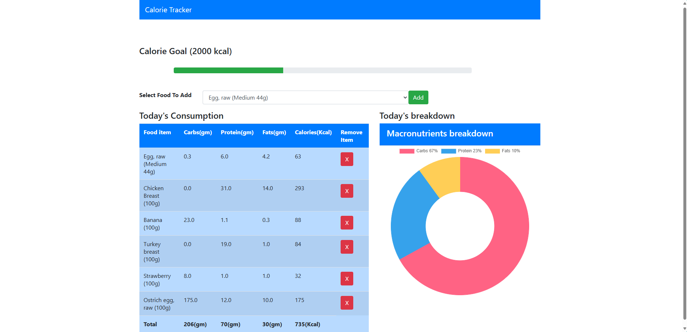

## calorie_tracker_django_zaliczenie
Projekt na zaliczenie. Lokalna webowa aplikacja do liczenia kalorii oraz makrosłkadników.

# Opis funkcji:

- liczenie kalorii oraz makroskładników na podstawie kilku podanych składników
- zliczanie spożytych makroskładników to jest węglowodanów, białek i tłuszczów, przedstawione również w formie diagramu kołowego
- zliczanie kalorii z ustaloną wartością na 2000 kalorii
- prosty interfejs webowy z formularzem i tabelą.

# Instalacja
Zainstaluj zależności
`pip install -r requirements.txt`

Utwórz i włącz wirtualne środowisko
`python -m venv .venv`

Zainicjalizuj bazę
`python manage.py makemigrations`
`python manage.py migrate`

Uruchom aplikację
`python manage.py runserver`

Aplikacja będzie dostepna localhost:8000

